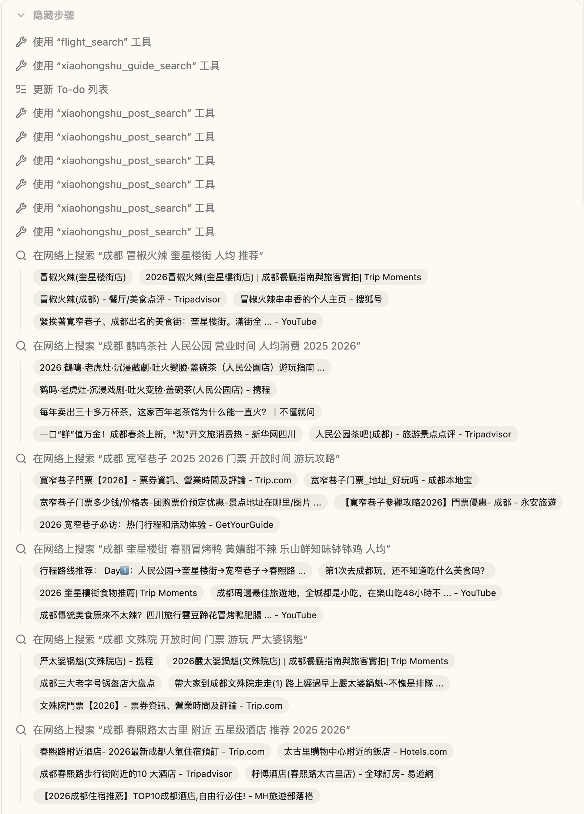
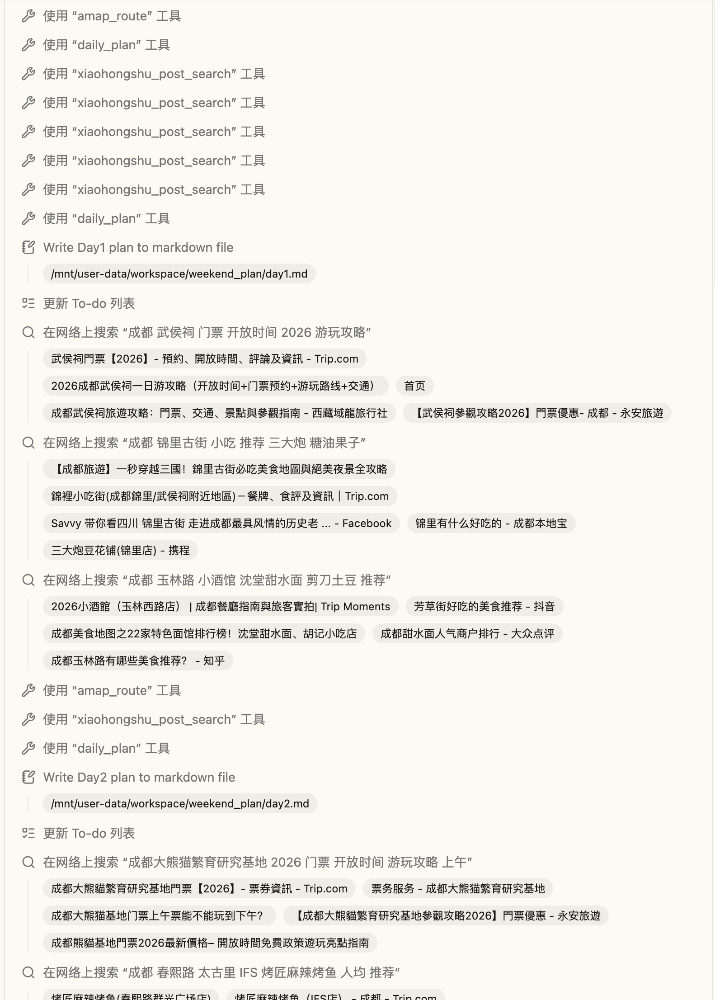
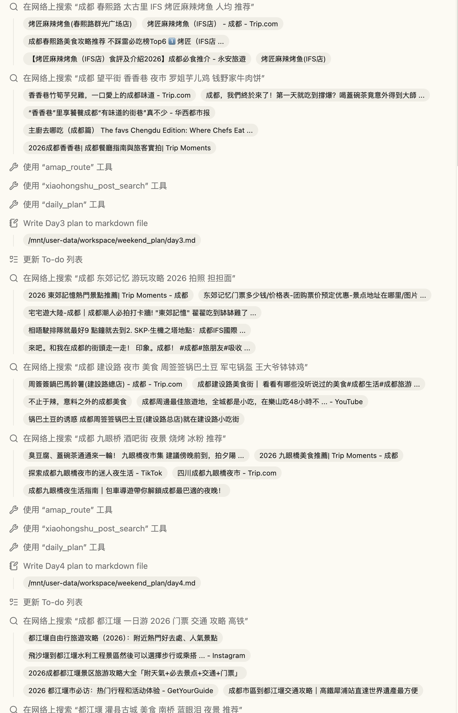
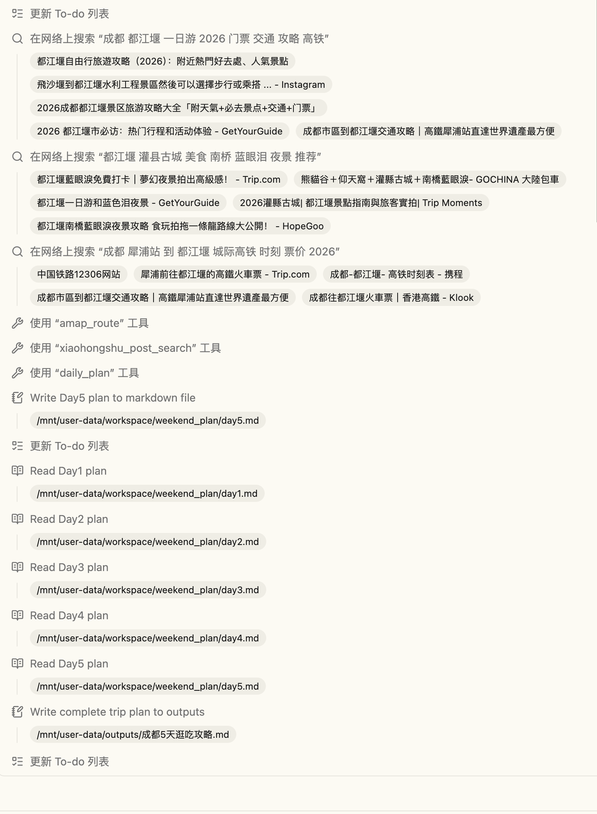

# 🧳 WeekenD

> **你的周末，到底是怎么「没」的？**
>
> 这次，让它有据可查地「有」起来。

<p align="center">
  
</p>

<p align="center">
  <strong>WeekenD</strong> —— 基于人格画像的本地周末探索与社交路线规划平台。
</p>

<p align="center">
  通过类 MBTI 人格测试了解你的偏好，结合当下状态与社交场景，<br/>
  为你推荐真正适合「今天的你和你的朋友」的本地吃喝玩乐路线。
</p>

<p align="center">
  <strong>Weekend + Do = WeekenD</strong> · 周末不是用来想的，是用来做的。<br/>
  这个周末，别再「随便」。
</p>

---

## 📺 一分钟看 Demo

<p align="center">
  <a href="https://www.bilibili.com/video/BV1zHEh6PEwz/">
    <strong>▶️ B 站观看：《WeeKenD —— 一键生成你的真实可用的旅游计划》</strong>
  </a>
</p>

> 🎬 视频里展示的机票价格、地点、路线规划**全部来自真实数据源，不是 AI 编的**。

**👉 看一份真实成品：[《成都 5 天逛吃之旅 · 完整攻略》](docs/samples/成都5天逛吃攻略.md)**

> 上海 + 北京双人成都汇合 5 天行程：机票、酒店、逐日路线、人均预算，**每个吃喝玩乐点都带可点击的小红书 / 携程 / 高德 / 官网信源链接**。打开就能用，地点都核实过。

---

## 🔥 为什么需要 WeekenD

**痛点一：周末不知道去哪，选择疲劳。** 打开大众点评看到几万条结果，反而更难决定。群聊里「随便你们定」说了半小时，最后不了了之。

**痛点二：多人出行，迁就来迁就去。** 有人想吃辣，有人不能吃辣；有人想逛街，有人想安静——碍于人情没人直说，最后去了一个所有人都将就的地方。

**痛点三：平台不了解你。** 大众点评只知道你搜了「火锅」，小红书推荐的是流量而不是你。没有人知道你今天是想充电还是放电，是一个人还是五个人，是想花 200 还是 20 块。

---

## ✨ WeekenD 怎么做

| 对比维度 | 大众点评 / 小红书 | **WeekenD** |
| --- | --- | --- |
| 解决的问题 | 找一个地方 | **规划一条所有人都满意的路线** |
| 推荐逻辑 | 评分 + 热度 + 位置 | **人格画像 + 当下状态 + 社交暗线** |
| 多人场景 | 无 | **核心功能：融合每人偏好推多人路线** |
| 数据飞轮 | 用户评论 | **打卡反馈 → 推荐更准 → 更愿意打卡** |
| 使用频率 | 有需要才搜 | **每周触点，习惯性打开** |

### 一个真实的用户故事

> 小陈，26 岁，在上海工作的运营。周五晚上朋友群里有人发消息「周六出来玩？」，群里立刻热闹起来——A 说想吃火锅，B 说最近上火不能吃辣，C 说想去看那个展览，D 说看展太无聊了。聊了一个小时，有人开始发「随便随便你们定」，然后群就沉默了。第二天各自在家刷手机，谁也没提昨晚说好的事。
>
> **有了 WeekenD 之后：** 小陈在 WeekenD 里发起「周末局」，邀请朋友加入。每人私下告诉 AI 自己的偏好和雷点（不想吃香菜、不想逛商场、预算 150 以内），AI 综合所有人数据，推出一条大家都满意的路线。暗线数据只有 AI 看到，朋友之间不用尴尬。**迁就，交给 AI 就行。**

---

## 🧠 核心功能

### 1. 周末人格测试 —— 比 MBTI 更适合周末

8 道荒诞场景代入题，选项是内心 OS，不直接问偏好。测出你的 **5 维画像**：

| 维度 | 两极 | 测量什么 |
| --- | --- | --- |
| 能量方向 | 充电型 ↔ 放电型 | 周末需要安静恢复 vs 出去社交消耗 |
| 活动偏好 | 体验派 ↔ 漫游派 | 看展/手工/学东西 vs 随机逛/citywalk |
| 时间节奏 | 计划控 ↔ 随机派 | 提前定好 vs 当天再说 |
| 消费感受 | 仪式感派 ↔ 性价比派 | 精致一顿 vs 平价但氛围好 |
| 社交状态 | 独处/二人 ↔ 多人热闹 | 偏好的出行人数和社交密度 |

16 种周末人格，每种有专属名字、emoji 和画像。你是「孤狼策展人 🎯」还是「局の灵魂 🎉」？测完还能 **「摇一下」换同簇人格**，盲盒机制，最多 2 次。

**测试结果会写入记忆系统。** 下次你让 WeekenD 规划周末，它已经懂你了——独处型不硬推组队局，性价比型自动控预算，计划控给精确到分钟的时间表。

### 2. 单人周末规划 —— 对话式，像跟朋友聊天

```
"这周末想在上海 citywalk + 看个展，预算 200"
         ↓
WeekenD 先跟你聊清楚细节（几点、忌口、有没有特别想去的）
         ↓
小红书「点点 AI」出攻略骨架，原封不动展示给你看
         ↓
逐点坐实：每个地点都用真实帖子/官网/高德/携程验证
         ↓
输出一条完整路线：去哪、几点、人均、怎么走、排不排队
```

### 3. 多人组队路线 —— 核心差异化功能（规划中）

发起「周末局」，邀请朋友加入。每人私下告诉 AI 自己的偏好和雷点。AI 综合所有人数据，排除任意一人的雷点，找到最大公约数，推出所有人都满意的路线。**暗线数据只有 AI 看到，朋友之间不用尴尬。**

---

## 🔴 我们最自豪的一件事：**数据是真的**

市面上太多 AI 张口就来「XX 路有家网红咖啡，人均 50，下午人少」——你信了，去了，发现店早就倒闭了。**WeekenD 从机制上杜绝这件事。**

| 真实数据来源 | 接入方式 | 拿到的是什么 |
| --- | --- | --- |
| **小红书「点点 AI」** | 真实 RPA 调用 | 基于真实笔记的攻略骨架（原文 + 配图） |
| **小红书帖子搜索** | 真实 RPA 调用 | 带封面图、点赞、作者、原帖链接的真实笔记卡片 |
| **高德地图** | 真实 API | 每段路线的真实距离、耗时、导航步骤 |
| **携程机票** | 真实 RPA 调用 | 跨城出行的真实航班时刻与价格 |
| **Firecrawl 联网搜索** | 真实 API | 官网票价、开放时间、是否预约等实时硬事实 |

### 三道工具级硬校验，杜绝 AI 编造地点 🛡️

每一天的行程提交时，工具 `daily_plan` **逐条死磕**，不达标直接打回让模型重查：

1. **`missing_sources`**：任何一个地点没有真实信源 URL → **拒绝提交**
2. **`sources_not_grounded`**：某个地点的信源全是攻略骨架、没有逐点坐实 → **拒绝提交**
3. **`no_xhs_post_source`**：这一天一篇带封面图的真实小红书帖子都没采用 → **拒绝提交**

> 在 WeekenD 里，模型想偷懒编一个地点，工具层面根本过不去。

### 真枪实弹：一次完整规划跑了 60+ 次工具调用 🧪

下面是一次真实的周末规划对话全流程 —— Agent 自动调用小红书点点 AI、帖子搜索、高德路线、携程机票、Firecrawl 联网搜索等工具，**每一步都拿到真实数据，零幻觉**：

<p align="center">
  
  
</p>
<p align="center">
  
  
</p>

---

## 🗺️ 黄金流程：逐天规划、当天落盘、最后拼接

```
① 先把你聊明白（去几天、几点、想干嘛、预算、忌口）
        ↓
② 先建 TODO 清单（拆成「规划 Day1 / Day2 / …」）
        ↓
③ 小红书点点 AI 出骨架（这天大致去哪几个区域）
        ↓
④ 逐点坐实：帖子搜索 / 高德 / 携程 / 联网核实，每个点拿到真实信源
        ↓
⑤ daily_plan 提交（过三道信源硬校验）→ 立刻写成 dayN.md 落盘
        ↓
⑥ 全部规划完，读回各天 md 拼成完整方案 → 生成打卡卡片 / 路线卡海报
```

---

## 🏗️ 技术架构

```
┌─────────────────────────────────────────────────────┐
│                     前端 (Next.js)                    │
│  React 19 · Tailwind v4 · shadcn/ui · 人格测试组件    │
├─────────────────────────────────────────────────────┤
│                  Agent 框架 (DeerFlow)                 │
│  Sub-Agent 编排 · 记忆系统 · 沙箱 · 可扩展 Skill 体系   │
├─────────────────────────────────────────────────────┤
│                      WeekenD 工具层                    │
│  guide_search · post_search · extract_poi ·          │
│  amap_route · flight_search · daily_plan ·           │
│  feasibility_check · checkin · route_card_gen         │
├─────────────────────────────────────────────────────┤
│                      真实数据源                        │
│  小红书点点 AI / 帖子搜索 (RPA) · 高德 API ·           │
│  携程 (RPA) · Firecrawl · DeepSeek V4 Pro             │
└─────────────────────────────────────────────────────┘
```

---

## 📊 竞品对比：为什么只有 WeekenD 能解决这个问题

| 产品 | 核心定位 | 对我们的场景的局限 |
| --- | --- | --- |
| 大众点评 | 本地生活服务平台 | 只能找地方，无法规划多人满意路线 |
| 小红书 | 内容种草平台 | 推荐基于流量非个人匹配，无多人偏好融合 |
| 圆周旅迹 | 异地旅行行程规划 | 面向异地旅游，无本地高频内容，无多人偏好融合 |
| 高德/百度地图 | 导航+周边推荐 | 推荐逻辑是距离+热度，无人格匹配，无社交场景 |
| 即刻/Soul | 兴趣社交 | 只能找人，不推荐去哪，无路线规划能力 |

**结论：现有产品要么只解决「找地方」，要么只解决「异地旅行规划」，没有产品真正解决「多人本地周末、所有人都满意」这个高频真实痛点。** WeekenD 的差异化在于用「人格数据 + 社交暗线」切入了被所有人忽视的场景。

---

## 💰 商业模式（三阶段）

| 阶段 | 用户量 | 变现方式 |
| --- | --- | --- |
| **阶段一** | 0 → 1 万 | 先跑通产品闭环，不急变现 |
| **阶段二：导流佣金** | 1 万 → 10 万 | 用户看完路线推荐跳转至大众点评/美团预约，平台按导流计费 |
| **阶段三：精准投放** | 10 万+ | 商家定向投放：新开精品咖啡馆 → 定向「充电型+仪式感派」用户；新开剧本杀 → 定向「放电型+多人热闹」用户。比大众点评关键词广告更精准——**我们知道你此刻是什么状态、跟谁出门** |

---

## 🚀 MVP 范围

| 模块 | 内容 |
| --- | --- |
| ✅ 周末人格测试 | 8 道场景代入题 → 5 维画像 → 16 种人格 → 盲盒机制 |
| ✅ 单人路线推荐 | 对话式，基于人格 + 真实数据，逐点坐实拿信源 |
| ✅ 路线展示 | 按人格簇定制路线风格 + 推荐理由 + 附信源链接 |
| ✅ 路线卡生成 | 纪念路线卡海报，可截图分享 |
| ✅ 打卡 + 反馈 | 逐站打卡，反馈回流优化下次推荐 |
| 🔜 多人组队 | 发起/加入周末局，暗线偏好，AI 多人路线推荐 |
| 🔜 搭子广场 | 陌生人匹配，人格相似的人一起去 |

---

## 🙏 致谢

WeekenD 基于 [字节跳动开源的 DeerFlow](https://github.com/bytedance/deer-flow) 构建，感谢 DeerFlow 团队提供的强大 Agent 基础设施。

---

<p align="center">
  <strong>WeekenD · 今天去哪</strong><br/>
  <em>周末不是用来发愁去哪的，是用来真正享受的。</em>
</p>